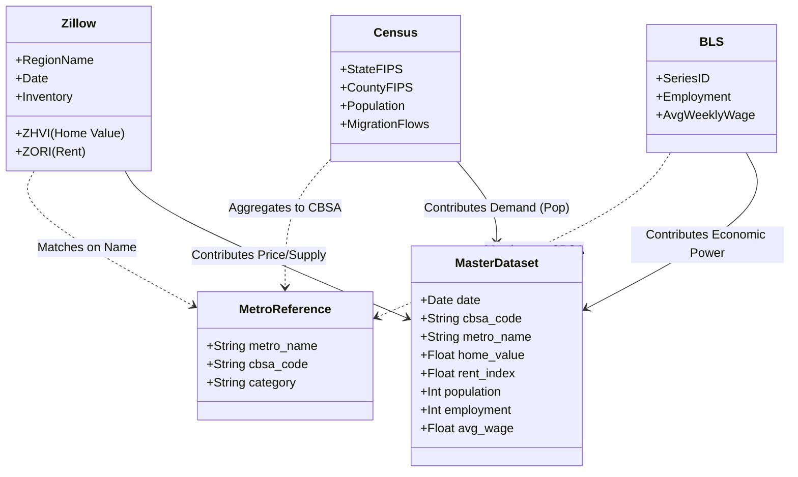

# 🔗 Dataset Connections & Schema

This document explains how the disparate datasets (Zillow, Census, BLS, etc.) are connected to form a unified analysis of the housing market.

## 🔑 The Common Key: CBSA Code

The primary "glue" holding these datasets together is the **CBSA Code** (Core Based Statistical Area). This is a unique 5-digit identifier for metropolitan areas defined by the OMB.

| Dataset | Native Key | Connection Method |
|---------|------------|-------------------|
| **Zillow** | `RegionName` (e.g., "Austin, TX") | Mapped to CBSA via `metro_reference.csv` |
| **BLS** | `SeriesID` (e.g., "SMS4812420...") | Parsed to extract CBSA (digits 5-9) |
| **Census** | `State` + `County` FIPS | Aggregated up to CBSA level |
| **FHFA** | `CBSA Code` | Direct match |

## 📊 Data Relationship Diagram

## 🧠 Thematic Connections (The "Why")

Beyond just sharing a key, these datasets are causally linked in the real world. This project analyzes these causal chains:

### 1. Migration → Housing Demand (Census + Zillow)

* **Connection:** Census `Migration Flows` (People moving CA → TX) directly impacts Zillow `Sales Count` and `Inventory`.
* **Lag:** Migration trends often precede price changes by 6-12 months.

### 2. Employment → Affordability (BLS + Zillow)

* **Connection:** BLS `Wages` and `Employment` levels determine the purchasing power for Zillow `Home Values`.
* **Metric:** `Home Price / Income Ratio` is derived by joining these two sources.

### 3. Supply vs. Demand (Census + Zillow)

* **Connection:** Census `Building Permits` (New Supply) vs. Census `Population Growth` (New Demand).
* **Impact:** This balance drives Zillow `ZHVI` (Price) and `ZORI` (Rent) trends.

## 🛠️ Implementation Details

The `data_cleaner.py` script handles these joins:

1. **Standardization:** Converts all dates to `YYYY-MM-01`.
2. **Mapping:**
    * **Zillow:** Uses string matching to align "Austin, TX" with CBSA `12420`.
    * **BLS:** Extracts `12420` from Series ID `SMS4812420...`.
3. **Merging:** Performs an `outer` join on `[cbsa_code, date]` to create the time-series master dataset.

## 🗺️ County-Level Analysis (New)

In addition to the Metro-level analysis, we now support granular County-level analysis for California and Texas:

* **Scripts:** `ca_county_cleaner.py` and `tx_county_cleaner.py`
* **Key:** FIPS Code (State + County)
* **Joins:**
  * **Zillow:** `zhvi_county.csv` (Home Values)
  * **Census:** `population_estimates.csv` (Annual Pop)
* **Purpose:** To identify specific high-growth counties within the broader metro areas.
